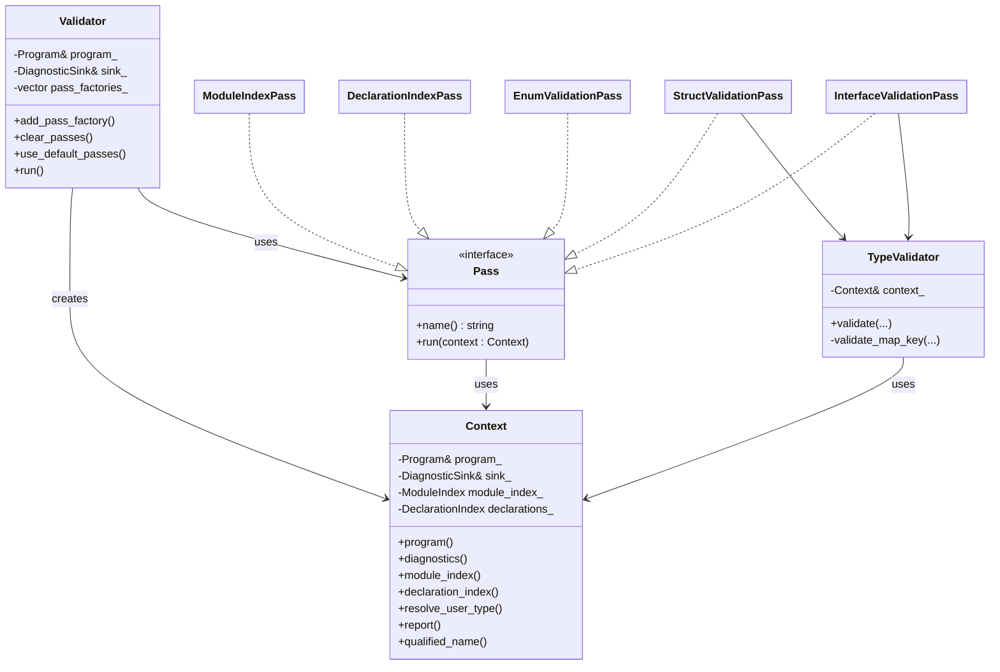
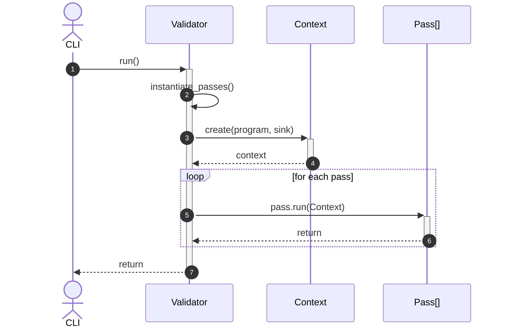
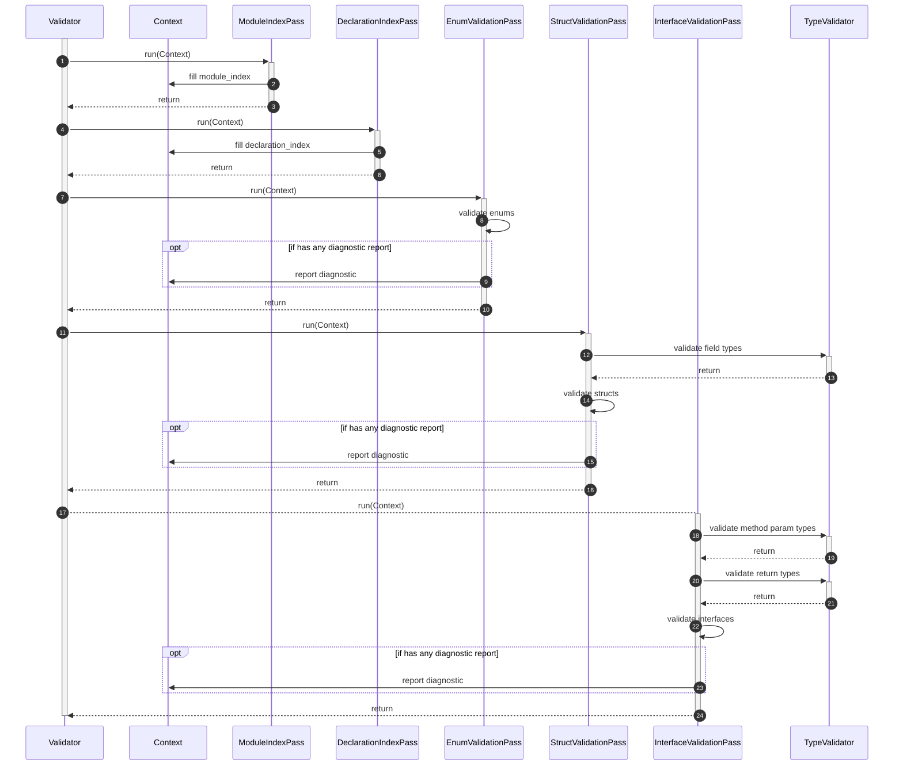

# Semantic Validation Architecture

This document briefly describes the semantic analysis pipeline. The `Validator` orchestrates a collection of independent passes, each consuming a shared `Context`. This enables easy composition of checks, optional pass selection, and reusable helpers such as the `TypeValidator`.

## Class Diagram

## Sequence Diagrams

### High-level senquence

### Detailed sequence with current passes included

